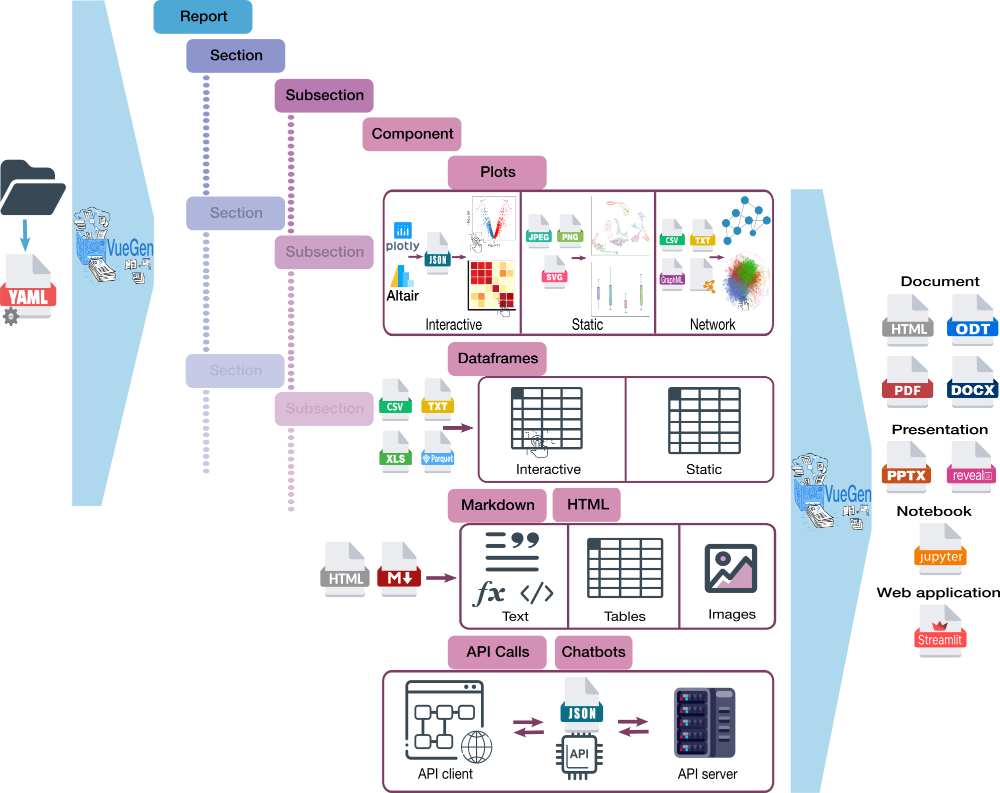

<!-- <div align="center">
  
</div> -->

-----------------
<p align="center">
   VueGen is a Python library that automates the creation of scientific reports.
</p>

## Table of contents:
- [About the project](#about-the-project)
- [Installation](#installation)
- [Execution](#execution)
- [Contact](#contact)

## About the project
VueGen automates the creation of scientific reports based on a YAML configuration file.  This configuration file specifies the structure of the report, including sections, subsections, and various components such as plots, dataframes, markdown, and API calls. Reports can be generated in various formats, including documents (PDF, HTML, DOCX, ODT), presentations (PPTX, Reveal.js), notebooks (Jupyter) or [Streamlit](streamlit) web applications.

An overview of the VueGen workflow is shown in the figure below:

<!-- <p align="center">
<figure>
  
</figure>
</p> -->


Also, the class diagram for the project is presented below to illustrate the architecture and relationships between classes:

<!-- <p align="center">
<figure>
  
</figure>
</p> -->


## Installation

You can install the package for development from this repository by running the following command:

```bash
pip install -e path/to/vuegen # specify location 
pip install -e . # in case you pwd is in the vuegen directory
```

### Quarto installation

Install quarto with vueguen if you don't have it globally installed.

```bash
pip install -e ".[quarto]" # specify location
```

if you use conda a conda environement you can install quatro from the conda-forge channel 
in case it did not work.

```bash
conda install -c conda-forge quarto
```

Test your quarto installation by running the following command:

```bash
quarto check
```

## Execution

Run VueGen using a configuration file with the following command:

```bash
cd docs
vuegen --config example_data/MicW2Graph/report_config_micw2graph.yaml --report_type streamlit
```

> 💡 If `vuegen` does not work, try `python -m vuegen` instead.

By default, the `streamlit_autorun` argument is set to False, but you can use it in case you want to automatically run the streamlit app.

It's also possible to provide a directory instead of a configuration file:

```bash
vuegen --directory docs/example_data/MicW2Graph/ --report_type streamlit
```

The current report types are streamlit, html, pdf, docx, odt, revealjs, pptx, and jupyter.

## Contact
If you have comments or suggestions about this project, you can [open an issue][issues] in this repository.

[issues]: https://github.com/Multiomics-Analytics-Group/vuegen/issues/new
[streamlit]: https://streamlit.io/ 
